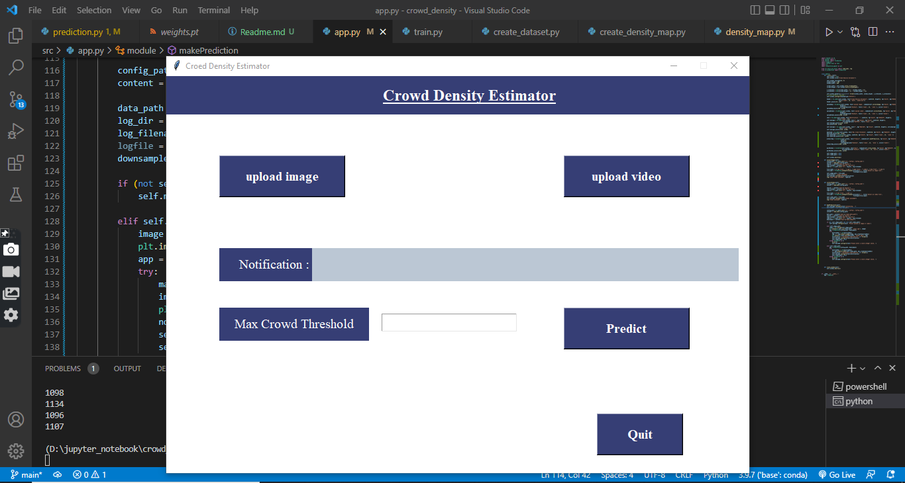
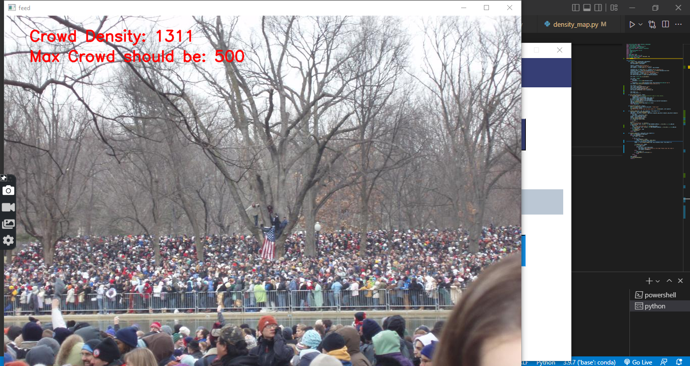

# Crowd-Density-Estimation

A desktop based application which can detect density of crowd in any public place. 
## Algorithm used

A Multicolumn Convolutional Neural Network (MCNN) is used for this application. It has three different columns, each of them has different sizes of kernel. It helps model to detect 
different sizes of head in crowd. 

## Framework

PyTorch
## Installation

* conda create --prefix ./env python==3.8 -y
* conda activate <<path_to_env_directory>>/env
* pip install -r requirements.txt

## Project Demo

### [Demo](https://www.linkedin.com/posts/arnab-mitra-882756227_connections-computervision-ai-activity-6962065440877543424-XG-4?utm_source=linkedin_share&utm_medium=member_desktop_web)

## Steps

### First go to the project directory and run 'python src/app.py' in command line.

#### Upload any image or video

#### Prediction

## Dataset 

[SanghaiTech Dataset](https://www.kaggle.com/datasets/tthien/shanghaitech)

## Team
### Abhishek Kumar Verma
### Aanchal Dwivedi

